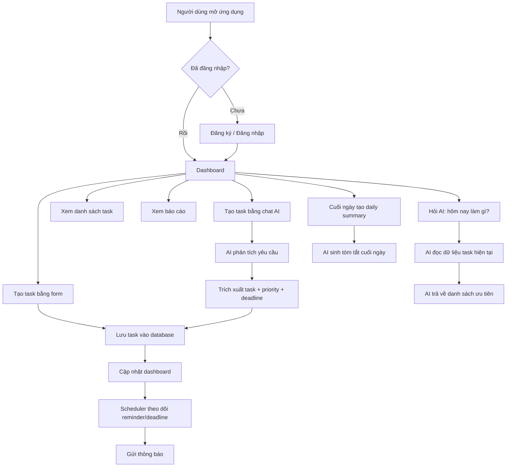
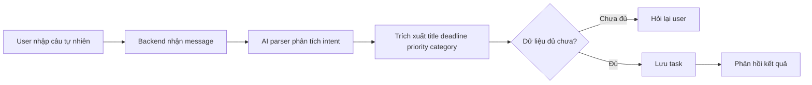
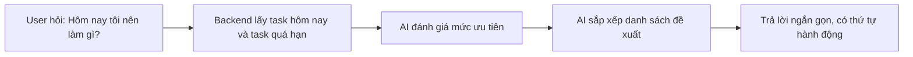
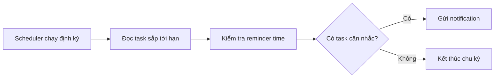
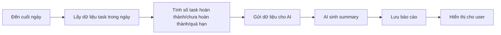

# User flow

## 1. User flow tổng quát

```mermaid
flowchart TD
    A[Người dùng mở ứng dụng] --> B{Đã đăng nhập?}
    B -- Chưa --> C[Đăng ký / Đăng nhập]
    B -- Rồi --> D[Dashboard]
    C --> D
    D --> E[Tạo task bằng form]
    D --> F[Tạo task bằng chat AI]
    D --> G[Xem danh sách task]
    D --> H[Xem báo cáo]
    E --> I[Lưu task vào database]
    F --> J[AI phân tích yêu cầu]
    J --> K[Trích xuất task + priority + deadline]
    K --> I
    I --> L[Cập nhật dashboard]
    L --> M[Scheduler theo dõi reminder/deadline]
    M --> N[Gửi thông báo]
    D --> O[Hỏi AI: hôm nay làm gì?]
    O --> P[AI đọc dữ liệu task hiện tại]
    P --> Q[AI trả về danh sách ưu tiên]
    D --> R[Cuối ngày tạo daily summary]
    R --> S[AI sinh tóm tắt cuối ngày]
```

## 2. User flow tạo task bằng chat

```mermaid
flowchart LR
    A[User nhập câu tự nhiên] --> B[Backend nhận message]
    B --> C[AI parser phân tích intent]
    C --> D[Trích xuất title deadline priority category]
    D --> E{Dữ liệu đủ chưa?}
    E -- Chưa đủ --> F[Hỏi lại user]
    E -- Đủ --> G[Lưu task]
    G --> H[Phản hồi kết quả]
```

## 3. User flow hỏi AI kế hoạch hôm nay

```mermaid
flowchart LR
    A[User hỏi: Hôm nay tôi nên làm gì?] --> B[Backend lấy task hôm nay và task quá hạn]
    B --> C[AI đánh giá mức ưu tiên]
    C --> D[AI sắp xếp danh sách đề xuất]
    D --> E[Trả lời ngắn gọn, có thứ tự hành động]
```

## 4. User flow reminder

```mermaid
flowchart LR
    A[Scheduler chạy định kỳ] --> B[Đọc task sắp tới hạn]
    B --> C[Kiểm tra reminder time]
    C --> D{Có task cần nhắc?}
    D -- Có --> E[Gửi notification]
    D -- Không --> F[Kết thúc chu kỳ]
```

## 5. User flow daily summary

```mermaid
flowchart LR
    A[Đến cuối ngày] --> B[Lấy dữ liệu task trong ngày]
    B --> C[Tính số task hoàn thành/chưa hoàn thành/quá hạn]
    C --> D[Gửi dữ liệu cho AI]
    D --> E[AI sinh summary]
    E --> F[Lưu báo cáo]
    F --> G[Hiển thị cho user]
```
